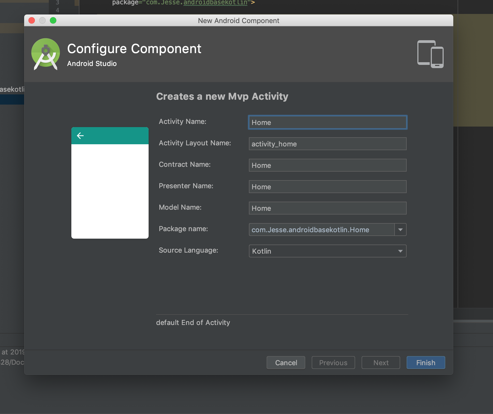
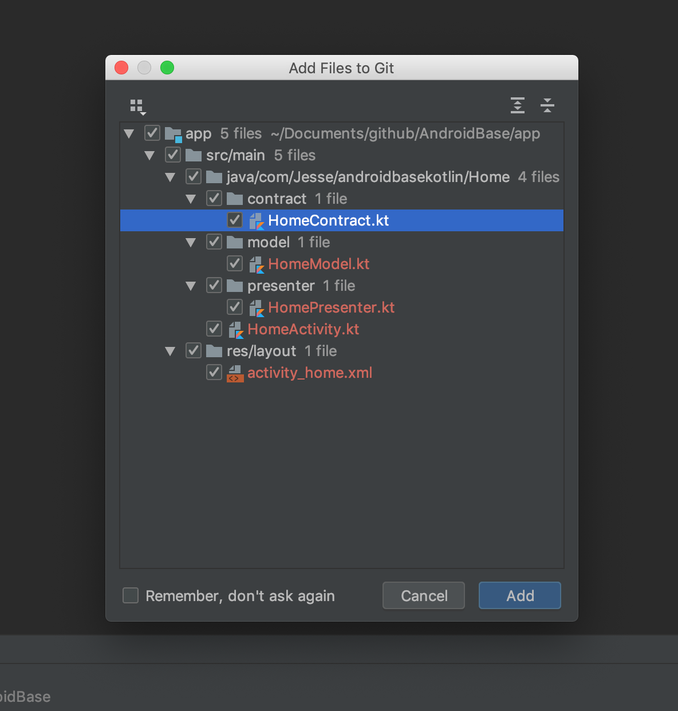

# AndroidBase
一个可以快速进行Android应用开发的基础库。

## 更新日志

- 2019-08-27 新增基于Rxjava实现的事件总线操作类
- 2019-08-21 自定义Retrofit+Okhttp网络请求类
- 2019-08-19 新增MVP代码模板，提高编码效率，支持java和kotlin
- 2019-08-15 新增mvp模式基类，支持多presenter，并且加入rx生命周期管理

## 如何使用

### MVP模板
1. 下载源码目录在 AndroidBase/MvpTemplate
2. 这里我以mac电脑为例，把其中的两个文件夹放入`{Android Studio installation dir}\Contents\plugins\android\lib\templates\activities\`路径下
3. 重启Android Studio
4. 新建Home文件夹，右键Home文件，依次点击New -> Jesse -> MVP Activity，填入名称，如下图：



点击finish后会生成5个文件，HomeContract契约类，HomePresenter，HomeModel，HomeActivity以及布局文件activity_home




### 网络请求
1. 继承BaseRetrofitManager抽象类，重写getBaseUrl()方法返回http请求的url
2. 根据业务需求可以重写headers()，params()等方法来自定义公共请求头和公共参数
3. 创建service，可以参考下面代码
```kotlin
val service: ApiService by lazy(LazyThreadSafetyMode.SYNCHRONIZED) {
	getRetrofit().create(ApiService::class.java)
}
```
4. 在presenter中可以这样调用RetrofitManager.service.getHomeData()


### 消息传递
1. 发送事件RxBus.post(TestEvent())
2. 消耗事件RxBus.toObservable(TestEvent::class.java)
具体方法可查看RxBus类

### rx生命周期处理

在BasePresenter类中封装了Rx中Observable随着activity或者fragment生命周期销毁的方法，避免了Rx引起的内存泄漏问题，通过compose操作符绑定，具体可查看BasePresenter类，注释写的很清楚。


